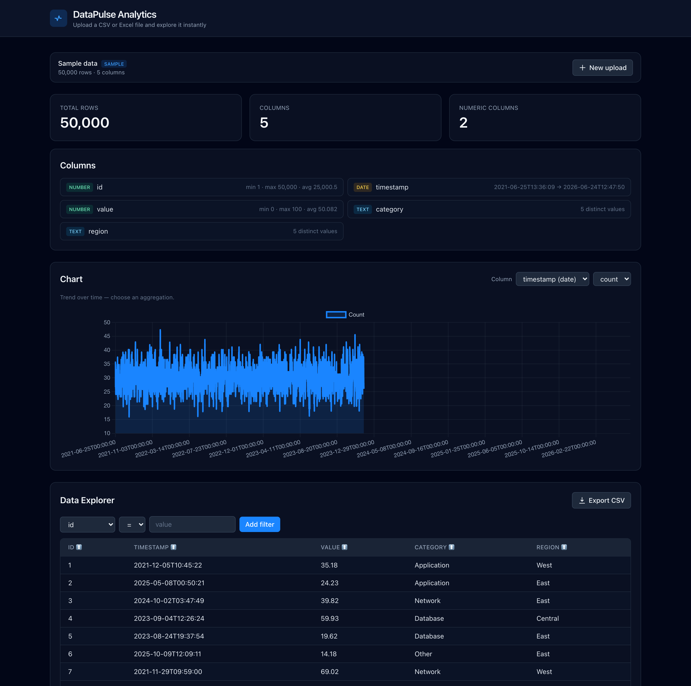
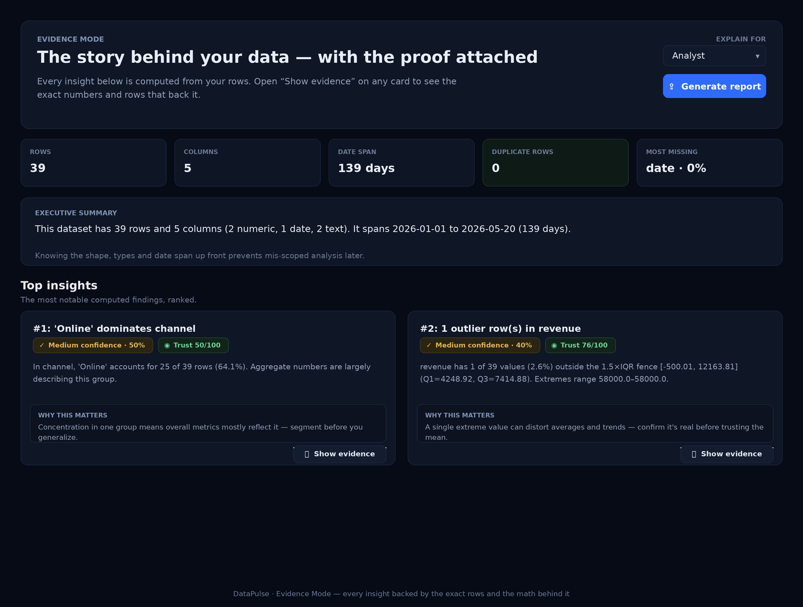

# DataPulse — Frontend

Upload or paste a spreadsheet and get instant analytics in the browser.
**Live:** https://datapulse-frontend.vercel.app



This is the React app. The [backend](https://github.com/ankanhq/datapulse) is a
separate FastAPI + DuckDB service.

## What's new
- **Evidence Mode** — turn any spreadsheet into a plain-English story with the proof attached.
- **Compare Mode** — compare two slices of your data and see exactly what changed and why.

## What it does

Drop in a CSV or Excel file — or paste spreadsheet text, or paste a file straight
from the clipboard (like you would in a chat app) — and DataPulse detects your
columns and renders a live dashboard:

- **Auto-detected schema** — each column is typed as number, date, or text, and
  the whole UI adapts to it.
- **Summary panel** — total rows/columns plus per-column basics.
- **Data Explorer** — a paginated table with click-to-sort headers and a filter
  builder whose operators change with the column type.
- **Adaptive chart** — pick any column; text columns get category counts, date
  columns get a time series (with count/avg/sum), number columns get a histogram.
- **CSV export** of the current filtered + sorted view.

There's a "Try with sample data" button so the dashboard works on first visit,
and everything is free with no signup. Files are capped at 25 MB and are never
stored — they're processed in memory by the backend and evicted automatically.

### Evidence Mode
Turns your spreadsheet into a set of plain-English insights — with the proof
attached. Every card is computed straight from your rows (real statistics, no
LLM): an executive summary, the most notable findings ranked, category
concentration, outliers, missing-data checks, correlations, and what changed most
over time. Each insight carries a confidence score and a trust score, and a
**Show evidence** button opens the exact rows and the calculation behind the
claim. Use **Explain for** (Student / Analyst / Founder / Manager / Researcher) to
reword the story, and **Generate report** to create a read-only shareable page.



### Compare Mode
Compare two slices of your data — two date ranges, two filter sets, or a second
uploaded file — and get the delta, % change, top movers, and a plain-English
reason the metric moved.

## Tech stack

- **React + Vite** — app and build tooling
- **Tailwind CSS** — styling
- **Chart.js** (via react-chartjs-2) — charts
- **TanStack Query** — data fetching and caching

## Setup

```bash
npm install
npm run dev      # http://localhost:5173
```

The app reads the backend URL from `VITE_API_BASE`, defaulting to
`http://localhost:8000`. Point it elsewhere with an env var:

```bash
VITE_API_BASE=http://localhost:9000 npm run dev
```

For production builds (e.g. on Vercel), set `VITE_API_BASE` to the deployed
backend URL — it's baked into the bundle at build time. See `.env.example`.

```bash
npm run build    # outputs to dist/
npm run preview  # serve the production build locally
```

### Accounts (Supabase)

The whole app is gated behind sign-in. Set these build-time env vars (Supabase
project → Settings → API); the anon key is public and safe in the browser, so no
secrets are committed:

```bash
VITE_SUPABASE_URL=https://YOUR-PROJECT.supabase.co
VITE_SUPABASE_ANON_KEY=your-public-anon-key
```

Signed-out visitors see only a login screen that uses **email OTP** (enter email
→ receive a 6-digit code → verify). Once signed in, the existing app renders and
the header shows the account email with a **Sign out** button. Every backend
request carries the Supabase access token as `Authorization: Bearer <token>`, so
each user only ever sees their own datasets and reports.

## Project structure

| File | Purpose |
|------|---------|
| `src/api.js` | Dataset-scoped client: upload, paste, sample, summary, query, chart, export |
| `src/App.jsx` | Switches between the upload landing and the dashboard for the active dataset |
| `src/components/UploadLanding.jsx` | Empty state: drag-and-drop upload, paste box, clipboard-file paste, sample button |
| `src/components/SummaryPanel.jsx` | Stat cards and per-column stats |
| `src/components/DataTable.jsx` | Paginated, sortable table with a per-type filter builder and CSV export |
| `src/components/AdaptiveChart.jsx` | Column picker + a chart that adapts to the column's type |
| `src/components/Layout.jsx` | App shell |
| `src/components/Spinner.jsx` | Loading indicator |

## Deployment

The backend repo's [DEPLOY.md](https://github.com/ankanhq/datapulse/blob/main/DEPLOY.md)
covers deploying this frontend to Vercel alongside the backend on Render.

